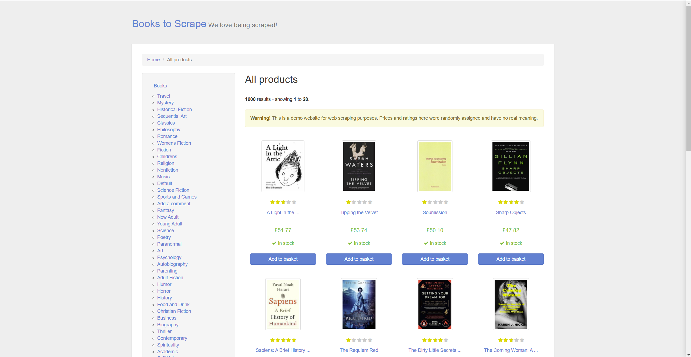

### Books to Scrape
[Click to check the website](https://books.toscrape.com/)

Description: This project involves web scraping to analyze and visualize book ratings and prices across different genres from an online bookstore. The analysis focuses on extracting genre-based data, calculating average ratings, and exploring price trends. Using the collected data, it reveals that niche genres like Christian Fiction, Art, and Poetry tend to have higher average ratings, while broader categories such as Psychology and Biography are rated lower. The project concludes that book ratings have minimal impact on pricing, with genre being the primary price determinant.

**Technology**:
* Python (including BeautifulSoup for scraping and Pandas for data processing)
* Data visualization libraries (e.g., Matplotlib or Seaborn, if applicable)

**Results**:

* A cleaned and structured dataset with genre, rating, and price information.
* Visualizations demonstrating the average ratings per genre, highlighting highly rated categories.
* Insights into the weak relationship between rating and price, emphasizing genre as a price influencer.
