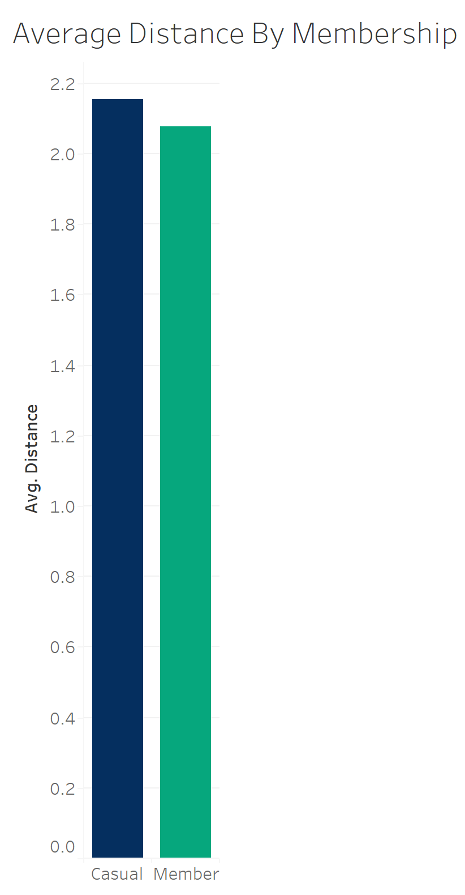
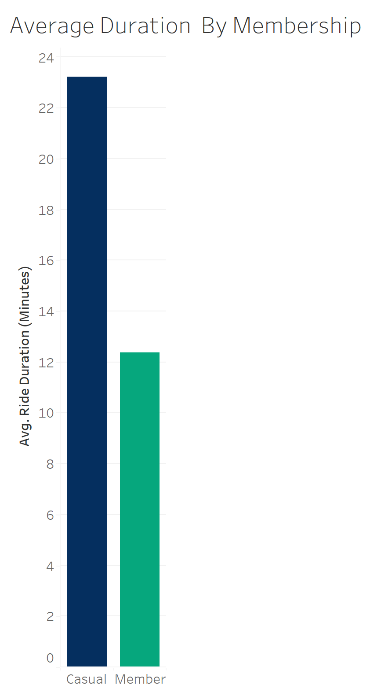
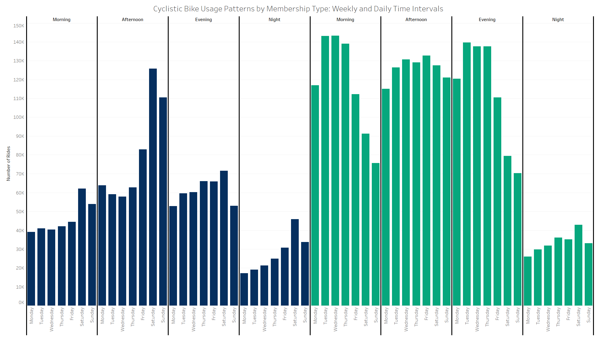
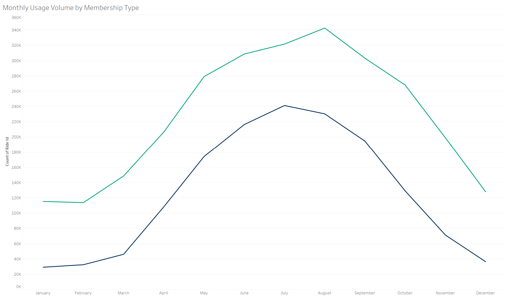
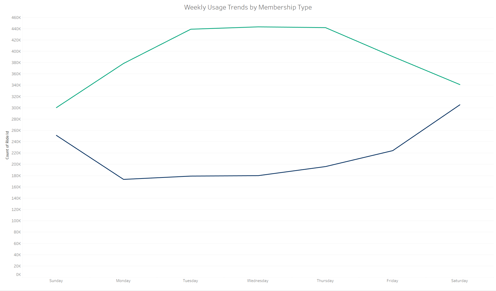
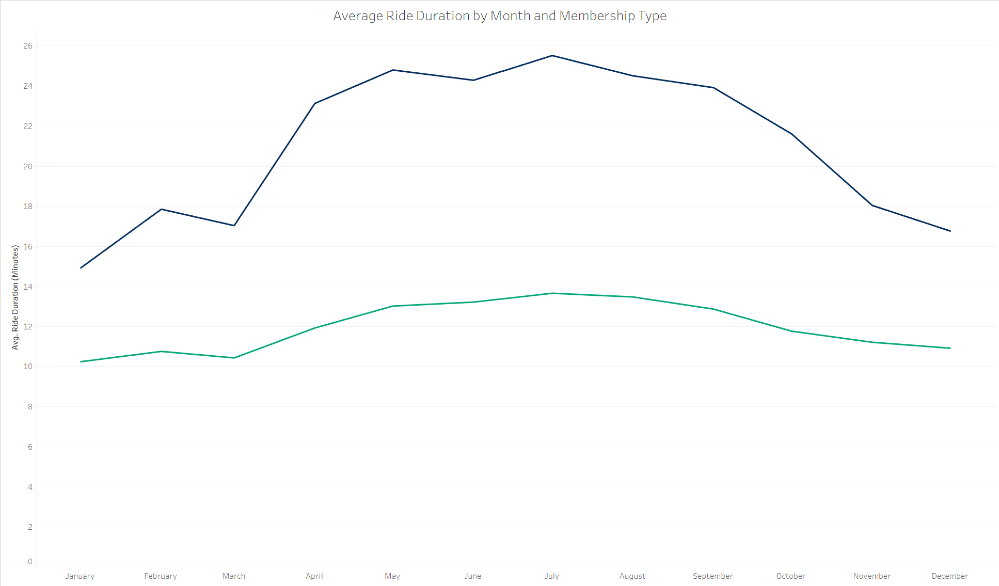
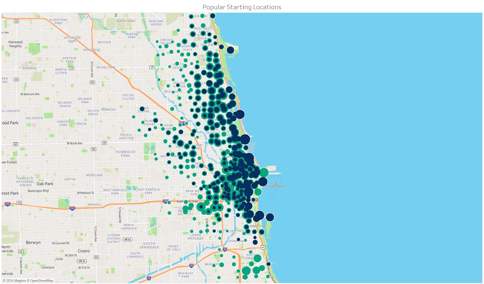
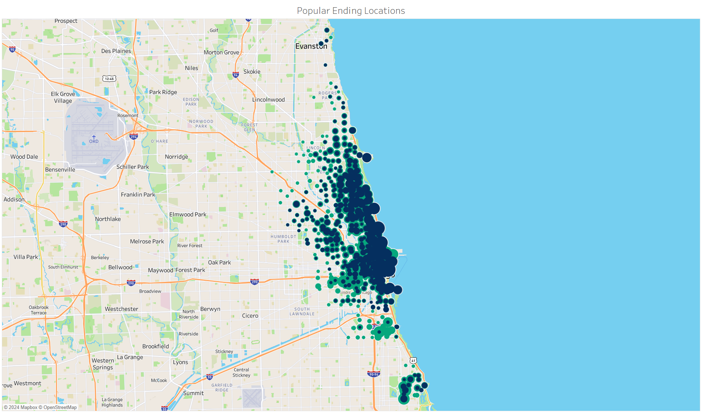
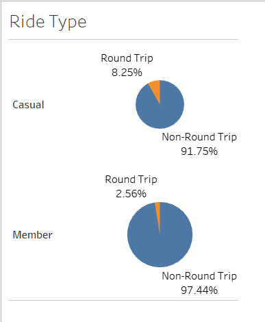
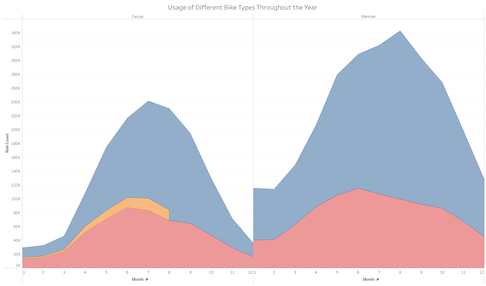

Cyclistic - Bike Share

Introduction

This project is the capstone for the Google Data Analytics Professional Certificate course. In this scenario, I take on the role of a junior data analyst at Cyclistic, a fictional bike-share company. The goal of the analysis is to understand the differences in bike usage between Cyclistic’s casual riders and annual members. By gaining insights into these patterns, Cyclistic aims to develop strategies to convert casual riders into members.

I conducted the analysis by following the six-step data analysis process recommended by Google: Ask, Prepare, Process, Analyze, Share, and Act. Each step builds upon the previous one, guiding the project from defining the business question to presenting actionable recommendations based on data-driven insights.

## Scenario

As a junior data analyst on the marketing analytics team at Cyclistic, a bike-share company in Chicago, I am tasked with helping the company expand its annual memberships. Cyclistic, which operates over 5,800 bicycles and 600 docking stations, aims to stand out with a diverse range of bikes, including reclining bikes, hand tricycles, and cargo bikes. This inclusivity allows people with disabilities and those who may not use standard bicycles to enjoy bike-sharing. Although most Cyclistic users ride for leisure, about 30% use the bikes to commute to work.

The director of marketing, Lily Moreno, believes that the future success of Cyclistic depends on increasing the number of annual memberships. Therefore, she wants our team to analyze how casual riders and annual members use Cyclistic bikes differently, as this insight will drive a marketing strategy to convert casual riders into annual members. However, any recommendations must be supported by compelling data insights and visualizations, as they will need to be approved by the detail-oriented Cyclistic executive team.

### Guiding Questions

Our analysis and future marketing program are driven by three key questions:

1. How do annual members and casual riders use Cyclistic bikes differently?
2. Why would casual riders choose to buy Cyclistic annual memberships?
3. How can Cyclistic use digital media to influence casual riders to become members?

I have been assigned the first question: understanding the differences in how annual members and casual riders use Cyclistic bikes. 

Step 1: Ask
Business Task
Objective: Understand the differences in usage patterns between Cyclistic’s casual riders and annual members to create strategies for converting casual riders to members.
Key Stakeholders
Lily Moreno - Director of Marketing, leading campaign development and responsible for increasing annual memberships.
Cyclistic Marketing Analytics Team - Analyzes and reports data to shape marketing strategies.
Cyclistic Executive Team - Decision-makers approving the final strategy.

Step 2: Prepare
Data Location
Source: Divvy Trip Data - provided by Motivate International Inc. under a licensed agreement.
Storage: Data files are stored on a local drive for organized access and analysis.
Data Organization
The dataset contains the following columns:
ride_id, rideable_type, started_at, ended_at, start_station_name, start_station_id, end_station_name, end_station_id, start_lat, start_lng, end_lat, end_lng, member_casual
These fields provide details on bike type, location data, and user membership type, all essential for analyzing rider behavior and addressing our business question.
Credibility and ROCCC Assessment
Reliable: The data is directly sourced from Cyclistic’s licensed repository.
Original: It is sourced directly from Cyclistic, ensuring originality.
Comprehensive: Includes necessary data fields to address the business task. We will verify comprehensiveness further by ensuring all rider types and bike types are represented.
Current: Represents trips from 2023, providing up-to-date data for analysis.
Cited: The data is cited and openly licensed, maintaining legal integrity.
Licensing, Privacy, Security, and Accessibility
The data is licensed for public use and has no personally identifiable information (PII), adhering to privacy and security standards.
Data Integrity Verification Plan
To ensure data integrity:
Missing Values Check: Identify blank values in essential columns.
Duplicate Check: Ensure unique ride_ids to avoid double-counting rides.
Date Format Verification: Confirm valid and consistent date formats for started_at and ended_at.
Category Consistency Check: Verify consistency in member_casual and rideable_type categories.
Relevance to Business Task
The dataset provides adequate details, including timestamps and membership type, allowing for a detailed analysis of how casual riders and annual members use Cyclistic bikes differently.
Initial Observations
Minor data issues like blanks and potential duplicates will be checked and addressed in the Process phase.

Step 3: Process
Data Combination
Using PostgreSQL, we combined multiple monthly CSV files into a single unified table, cyclistic_data, resulting in over 5.7 million records. This table includes key details such as:
Ride ID: A unique identifier for each ride.
Bike Type: The type of bike used (e.g., classic, electric).
Timestamps: Start and end times for each ride.
Station Information: Names and IDs for starting and ending stations, along with their latitude and longitude coordinates.
Membership Type: Specifies whether the rider is a casual user or an annual member.
Data Cleaning
To ensure data quality and avoid duplicated or incomplete records, we created a cleaned version of the table named cyclistic_data_clean. This step involved:
Removing Duplicates: We retained only distinct records to avoid double-counting.
Filtering for Completeness: Rows with null values in critical fields (e.g., ride ID, bike type, timestamps, and station information) were excluded.
Data Enrichment
To facilitate deeper analysis, we added several derived columns:
Time Features: New columns for month, day of the week, and specific time were extracted from the started_at and ended_at timestamps. These additions enabled us to examine seasonal and weekly usage trends.
Key Metrics:
Ride Duration: Calculated by finding the time difference between start and end times, providing insight into how long each ride lasted.
Distance: Using the Haversine formula, we computed the approximate distance between the start and end coordinates, which allows for a comparison of ride distances.
Round Trip Indicator: A boolean column (is_round_trip) was added to denote if the start and end stations were the same, indicating a round trip.
Data Filtering
To focus on realistic ride data, we removed outliers:
Unlikely Rides: Rides lasting less than 1 minute or more than 24 hours were considered unlikely and removed, as they likely represent data errors or unintentional rentals.

Step 4: Analyze

The analysis shows that both casual and member riders have a similar average distance per ride, with casual riders covering approximately 2.15 km and members covering 2.07 km. This negligible difference suggests that, despite differences in membership type, riders tend to use Cyclistic bikes for trips of similar lengths on average.

----

This analysis reveals a substantial difference in average ride duration between member and casual riders. While both membership types cover similar distances, casual riders tend to spend nearly twice as long on their trips, with an average duration of 23.20 minutes compared to members' 12.36 minutes. This suggests that members use Cyclistic bikes at a faster pace, possibly indicating that members prioritize efficiency, while casual riders may use the service more leisurely.

----

This graph highlights distinct patterns in bike usage between member and casual riders. Members use Cyclistic bikes significantly more often than casual riders, particularly on weekdays. This trend suggests that members likely use the bikes for commuting or other routine travel needs during the workweek. In contrast, casual riders show a higher bike usage on weekends, hinting at a more recreational or leisure-oriented purpose. The preference of casual riders for weekend rides aligns with a leisurely usage pattern, while members’ weekday dominance points to a practical, daily commuting trend.
This chart further supports the contrasting usage patterns between members and casual riders by breaking down bike usage by the time of day. Casual riders predominantly use bikes in the afternoon during weekends, which aligns with recreational or leisure activities. For members, the most frequent usage times are mornings and evenings on weekdays, which points to commuting hours, such as traveling to and from work or other routine destinations. Interestingly, bike usage at night is relatively similar across both groups, indicating that night-time rides may serve diverse purposes for both members and casual users. This combination of day and hour analysis reinforces the notion of members relying on Cyclistic bikes for practical, structured routines, while casual riders lean towards spontaneous, leisure-based usage.

----

The chart shows that both members and casual riders follow a similar seasonal pattern, with ride usage increasing through spring and peaking in the summer. However, in August, a unique divergence appears: member rides continue to increase, while casual rides begin to decrease. This contrast may indicate that members maintain consistent usage even in late summer, whereas casual riders may reduce their biking activities after the peak summer months.

----

This chart further reinforces the earlier observation: members tend to use Cyclistic bikes more during the weekdays, likely for commuting purposes, as the usage peaks mid-week. Casual riders, however, show a clear preference for weekend usage, aligning with more leisure-oriented or recreational use. This pattern highlights the contrasting riding habits between the two groups.

----

This chart shows that casual riders tend to use Cyclistic bikes for longer durations in the summer months, with a noticeable drop in average ride duration during winter. This seasonal variation aligns with leisure and recreational use, which typically peaks during warmer weather. For annual members, the average ride duration remains relatively stable throughout the year, suggesting a more consistent usage pattern likely tied to routine or commuting needs, regardless of the season.

----

  

The popular start and end locations remain consistent for both member types, showing no substantial change. However, casual riders tend to start and end their rides near the coast, possibly indicating recreational or leisure activities. In contrast, annual members frequently use bikes in central areas of the city, where markets, offices, and other work-related locations are situated, suggesting that members likely use bikes for commuting purposes.

----

The ride type analysis shows a clear distinction between casual and member riders. Casual riders take round trips (8.25%) significantly more often than members (2.56%), indicating a preference for returning to the same starting location. This pattern suggests casual riders likely use the bikes for recreational purposes, where a round trip is more convenient. In contrast, members, who have a higher percentage of one-way trips (97.44%), likely use the bikes for commuting or point-to-point travel, supporting a practical, transit-oriented usage pattern.

----

Casual riders use docked bikes early in the year, but this usage drops off by August, while members consistently avoid docked bikes entirely. This distinction might point to different preferences or usage patterns between the two groups.
During the summer, both casual and member riders overwhelmingly prefer classic bikes over electric ones. This suggests that the appeal of electric bikes might be linked to colder weather, potentially offering an advantage when physical effort is less desirable. While we might speculate that cost could also influence this choice, we don’t have data to confirm that.
