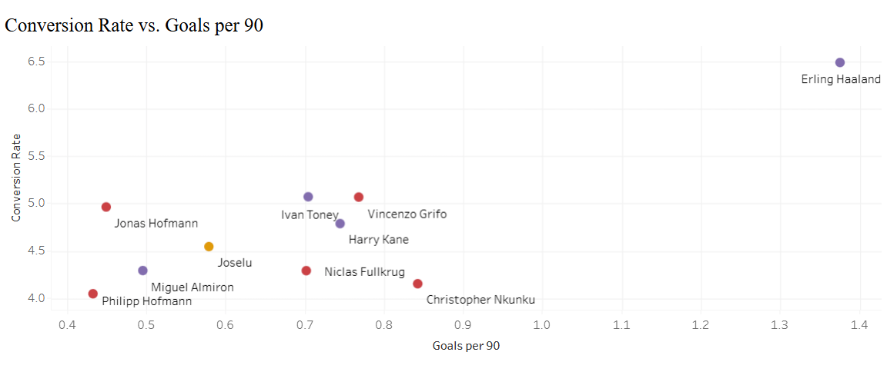

### Identifying the most Efficient Striker of 2022-23 season

[Click to see the dashboards](https://public.tableau.com/app/profile/muzaffer.cem.ates/vizzes)

**Description:** This project evaluates and compares the scoring efficiency of top strikers from the Premier League, La Liga, and Bundesliga during the 2022/23 season. Using key performance metrics such as Goals per 90 minutes, Conversion Rate, and Shots on Target Percentage, this analysis identifies the most efficient goal scorers in these elite leagues. The analysis follows Google’s data analysis process (Ask, Prepare, Process, Analyze, Share, and Act), ensuring a comprehensive approach.

**Technology**
* Python
* Tableau

**Results:**
* Identified Erling Haaland as the most efficient striker of the 2022/23 season across multiple key metrics.
* Provided insights into striker efficiency, highlighting the top 10 performers in Europe’s elite leagues.
* Created dashboards that offer a comprehensive view of scoring efficiency, accuracy, and league difficulty.
